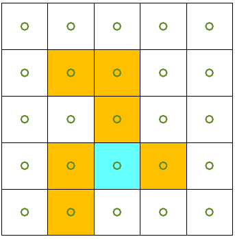
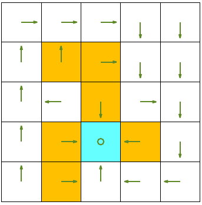

# Planning RL methods on FrozenLake 2×2 and 5×5

Three classical **planning** algorithms from reinforcement learning,
implemented from scratch with only Python + NumPy. No Gym, no Gymnasium.

| Algorithm                    | Branch                         |
|------------------------------|--------------------------------|
| Value Iteration              | `value-iteration`              |
| Policy Iteration             | `policy-iteration`             |
| Truncated Policy Iteration   | `truncated-policy-iteration`   |

Every branch contains its own README, the environment, and the algorithm's
source file.

---

## The family of planning algorithms

All three algorithms below assume we already have a **perfect model** of the
environment: the reward function `R(s, a, s')` and the transition function
`T(s, a) → s'`. Given the model, they compute the optimal value function and
policy *without ever interacting with the environment*. That is the essence
of **planning**, in contrast to **learning** (Q-learning, SARSA, PPO…), where
the model is unknown and values must be estimated from sampled experience.

They differ only in *how* they use the model:

- **Value iteration** performs one *Bellman-optimality* update per sweep:
V_{k+1}(s) = max_a [ R(s, a, s') + γ · V_k(s') ]


Very cheap per sweep, but usually many sweeps are needed.

- **Policy iteration** alternates between two steps until the policy stops
changing:

1. *Policy evaluation* — solve `v_π = r_π + γ·P_π·v_π` for the current
   policy `π`.
2. *Policy improvement* — `π' = argmax_π (r_π + γ·P_π·v_π)`.

The inner evaluation is run *to convergence*, so each outer step is
expensive but few outer steps are needed.

- **Truncated policy iteration** is the same two-step loop as policy
iteration, except the inner policy-evaluation is cut off after a *fixed
number of sweeps* (here `j_trunc = 30`) instead of being run to
convergence. This places it exactly between value iteration (1 inner
sweep) and full policy iteration (unbounded inner sweeps), and shows that
policy iteration does not need a perfectly evaluated value function at
every step — an important idea that later reappears in modern
actor–critic methods.

All three converge to the same optimal value function and policy.

---

## Environment

Hand-coded grid; no external simulator.

\
┌-----------┬-----------┬-----------┬-----------┬-----------┐\
│++s1++│++s2++│++s3++│++s4++│++s5++│\
├───┼───┼───┼───┼───┤\
│-s6- │-s7P │-s8P |-s9- │s10-│\
├───┼───┼───┼───┼───┤\
│s11- │s12- │s13P │s14- │s15-│\
├───┼───┼───┼───┼───┤\
│s16 │s17 │s18 │s19 │s20 │\
├───┼───┼───┼───┼───┤\
│s21 │s22 │s23 │s24 │s25 │\
└───┴───┴───┴───┴───┘\
\


**Actions:** `↑ = 1`, `→ = 2`, `↓ = 3`, `← = 4`, `○ = 5` (stay).

**Reward:**
- reaching the goal `s18 = (4,3)` : `+1`
- falling into a pit `s7, s8, s13, s17, s19, s22` : `−10`
- bumping into a wall : `−1`
- any other safe move : `0`

**Discount factor:** `γ = 0.9`



*Pits are shown in blue, the goal in red.*

---

## A 2×2 version

The 2×2 environment is also included (`2x2` folder on each branch):
s1 | s2 s2 = pit (−1), s4 = goal (+1)
----+---- γ = 0.9
s3 | s4


Because `s4` is not terminal in that toy version, the agent keeps collecting
`+1` forever and `V(s4) = 1 / (1 − γ) = 10`. It's a useful first toy, but
the 5×5 environment is where the algorithms get interesting.

---

## Results at a glance (5×5)

All three algorithms land on the same optimal policy:



- **Value iteration** — many sweeps, one Bellman-optimality update each.
- **Policy iteration** — 3 outer iterations, each with ~150+ inner sweeps
  until evaluation converges.
- **Truncated policy iteration** — a few outer iterations, each with exactly
  30 inner sweeps. Often reaches the same optimum in far fewer total
  updates.

Exact numbers depend on the convergence threshold `1e-10`.

---

## How to use this repo

```bash
git clone git@github.com:matinnem/planningRL_methods_on_frozenlake_2x2_and_5x5.git
cd planningRL_methods_on_frozenlake_2x2_and_5x5

# pick an algorithm
git checkout value-iteration
python valueIteration.py

git checkout policy-iteration
python policyIteration.py

git checkout truncated-policy-iteration
python truncatedPolicyIteration.py
Requirements: Python 3.8+ and NumPy.
